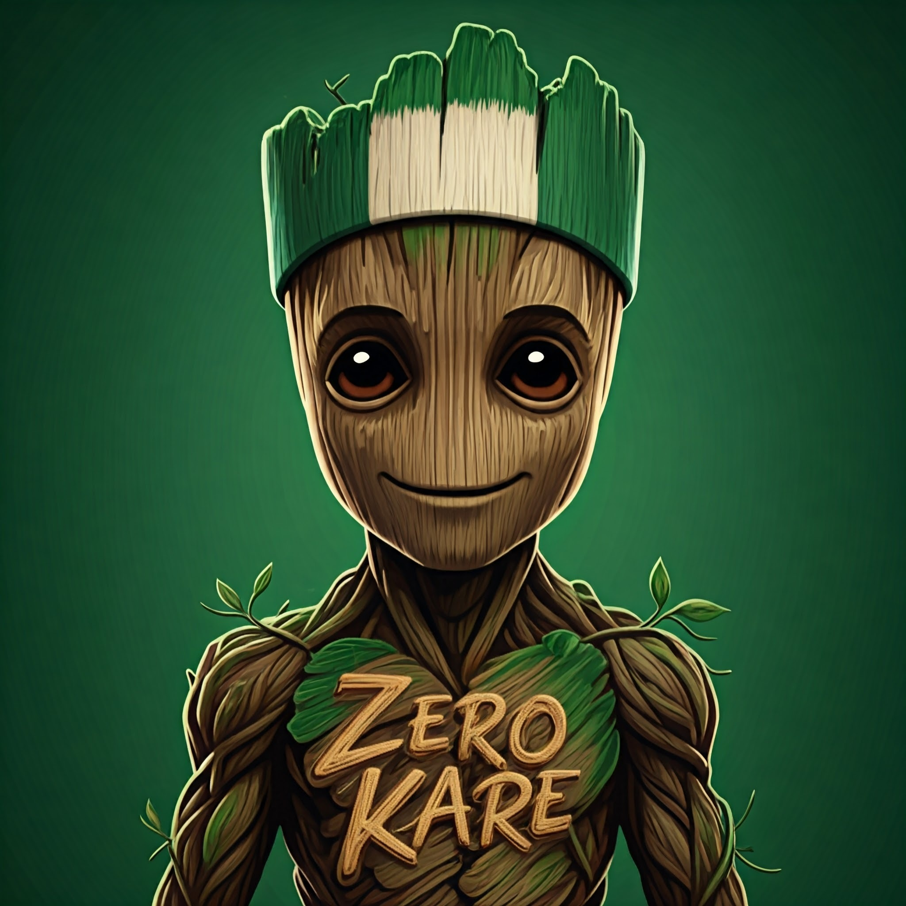

# med-zk server 




## How To Run
Create the file `mern/server/config.env` with your Atlas URI and the server port:
```
ATLAS_URI=mongodb+srv://<username>:<password>@sandbox.jadwj.mongodb.net/
PORT=5050
ENCRYPTION_KEY=your_64_character_hex_key_here_32byteshexkey1234567890abcdef
GEMINI_API_KEY=your_gemini_api_key
JWT_SECRET=your_super_secret_key
JWT_EXPIRY=1h # token expiration time
GOOGLE_MAPS_API_KEY=
OPENWEATHER_API_KEY=

```

Using WSL you can generate encryption key by running the command below in your terminal.
```bash
openssl rand -hex 32
```

Using docker, build the containers from the source directory where you find docker-compose.yml file.

```bash
docker-compose pull
```

then run the containers

```bash
docker-compose up -d
```

Verify containers are running

```bash
docker-compose ps
```

To view the server logs run

```bash
docker-compose logs server
```


change the script in the server package.json to
```bash
"scripts": {
    "start": "nodemon --env-file=config.env server", 
    "test": "echo \"Error: no test specified\" && exit 1"
  }
```
If you're not running with docker.

Start server:
```
cd mern/server
yarn
yarn start
```

Start Web server
```
cd mern/client
yarn
yarn dev
```

## Authentication and Score Saving Implementation

This section outlines the changes needed to add authentication to your application and enable saving scores from the `ee.html` iframe to your database.

### Server-Side Changes

1. **Install Packages:** Install the necessary packages: `passport`, `passport-local`, and `mongoose`.

   ```bash
   cd mern/server
   npm install passport passport-local mongoose
   ```

2. **Create User Model:** Create a `user.js` file in the `mern/server/models` directory:

   ```javascript
   // mern/server/models/user.js
   const mongoose = require('mongoose');
   const Schema = mongoose.Schema;

   const userSchema = new Schema({
     username: { type: String, required: true, unique: true },
     password: { type: String, required: true },
   });

   module.exports = mongoose.model('User', userSchema);
   ```

3. **Create Authentication Routes:** Create an `auth.js` file in the `mern/server/routes` directory (contents as previously provided).

4. **Integrate Authentication Routes:** In your `mern/server/server.js` file, add these lines to integrate the authentication routes:

   ```javascript
   const authRoutes = require('./routes/auth');
   app.use('/auth', authRoutes);
   ```

5. **Create Score API Endpoint:** Create an API endpoint (e.g., `/api/scores`) in your `server.js` to handle score submissions. This endpoint should verify the token and save the score to your database. Example:

   ```javascript
   app.post('/api/scores', passport.authenticate('jwt', { session: false }), (req, res) => {
       // Save score to database using req.body.score and req.user
   });
   ```

### Client-Side Changes (React with Vite)

1. **Create Login Component:** Create a `Login.jsx` component (contents as previously provided).

2. **Create Iframe Communicator Component:** Create an `IframeCommunicator.jsx` component (contents as previously provided).

3. **Update `App.jsx`:** Integrate the `Login` and `IframeCommunicator` components into your `App.jsx`.

4. **Update `ee.html`:** Update your `ee.html` file to listen for the authentication token and use it to make authenticated requests to the `/api/scores` endpoint. Example:

   ```html
   // ... (Inside ee.html) ...
   <script>
     // ... (message listener and saveScore function as previously provided) ...
   </script>
   ```

Remember to replace placeholders like API endpoints and database connection strings with your actual values.  This README provides a comprehensive guide to implementing the required changes.  Thoroughly review and adapt this to your existing codebase.
